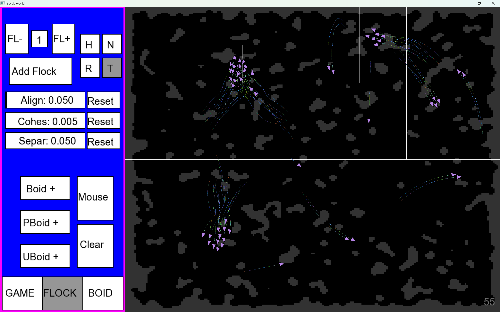
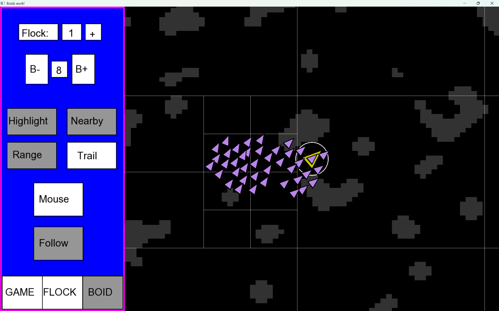
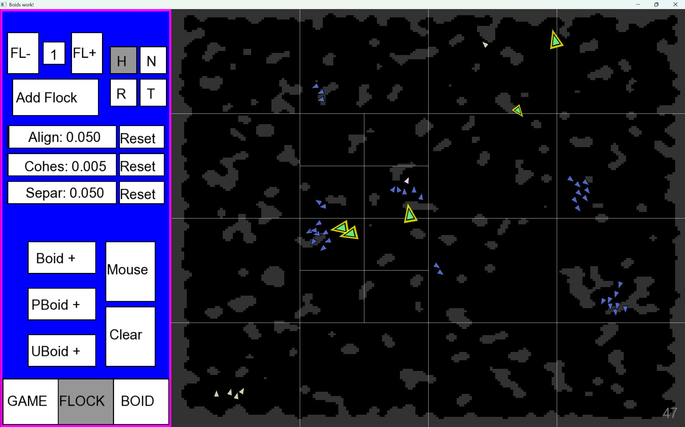

# Boids
A boids (bird-oid) implementation written in C++ with SFML. Uses QuadTree as a spatial partitioning to boost the performance of the boids calculations 
from O(n^2) to O(nlogn).

## The 3 boid rules

## Simplistic boids

https://user-images.githubusercontent.com/47519297/148255392-7950dd9a-37f4-43b5-a9c0-7590400d70a2.mp4

## QuadTree Visualization

## Specific Boid tracking

## Multiple flocks and predator boids

